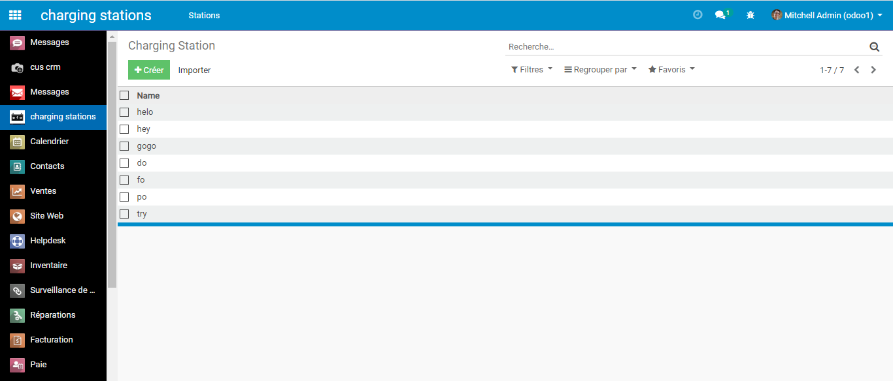

## Odoo is the best ERP for the next years

# Charging Station Module

This project was create with [Odoo 12](https://github.com/odoo/odoo/tree/12.0).

  

### `what is this ????`

odoo 12 module for manages electric charging stations charges and for calculating the final price for the customer of their
charging sessions

  

### `instalation`

  

### `Charging Station Menu`

  

### `Transactions Menu`

  

### `Transaction Tree view`

  

### `Supplier Prices Tree view`

  

### `Supplier Prices Form view`

  

### `Transaction Form view`

  

